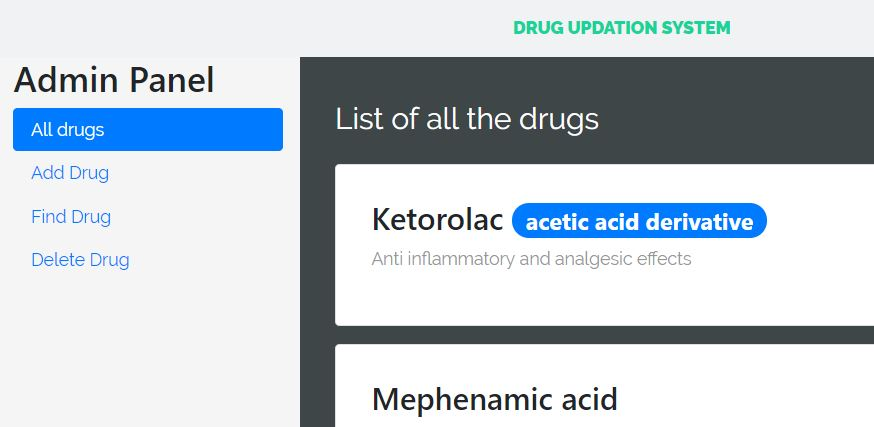

# DrugUpdationSystem

Run `ng serve` for a dev server. Navigate to `http://localhost:4200/`. The app will automatically reload if you change any of the source files.

Navigate to 'http://localhost:4200/admin' for admin login page.

Run `node MongoExpressServer.js` for running backend server.

##All drugs panel - Admin Panel

##Find and Delete - Admin Panel

